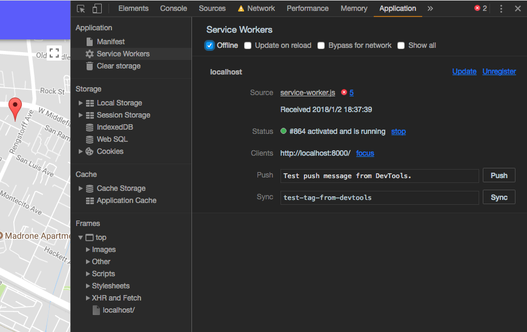

# Neighborhood Map - React
## Udacity
### Getting started
##### 1. Open your terminal and clone this repository in a directory you like:
```
$ git clone https://github.com/nekki-t/udacity-react-neighborhood-map.git
```
##### 2. Move to the directory which you cloned to:
```
e.g.
$ cd /{directory}/udacity-react-neighborhood-map
```
##### 3.  Install modules:
```
$ yarn
```
##### 4. Run app:
```
$ yarn start
```

### To run the app in production mode
#### 1. Build the app in production mode
```
$ yarn build
```

#### 2. Change your current directory to `build` folder
```
$ cd build
```

#### 3. Set the environment as a production mode
```
$ export NODE_ENV='production'
```

#### 4. Run server
If python3 is installed on your computer, run the server as below.
```
$ python3 -m http.server 8000
```
If your python version is less than 3, run it as below.
```
$ python -m SimpleHTTPServer 3000
```
or
```
$ npm install http-server -g
$ http-server -p 8000
```

#### 5. Visit the page and see on your browser
```
http://localhost:8000
```

### To test ServiceWorker
After you run the app in production mode, follow the following instruction.
#### 1. Open Chrome DevTools and 


#### 2. Check `Offline` in `Service Workers`


#### 3. Use your app with offline mode

-
